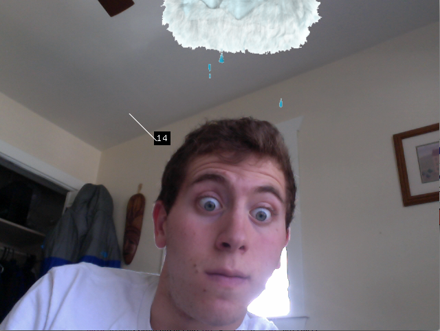
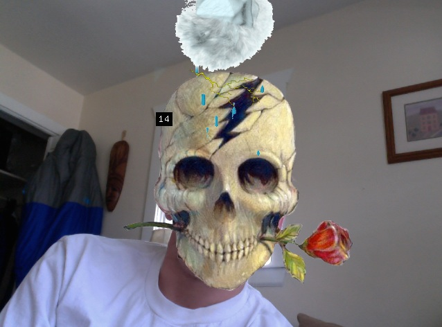

#Face Follower 
This program utilizes ofxGif and ofxCV to place a storm cloud that continuosly rains over the users head.

When the mouse is clicked a lightning strike triggers a skull mask to cover the user's face. 

