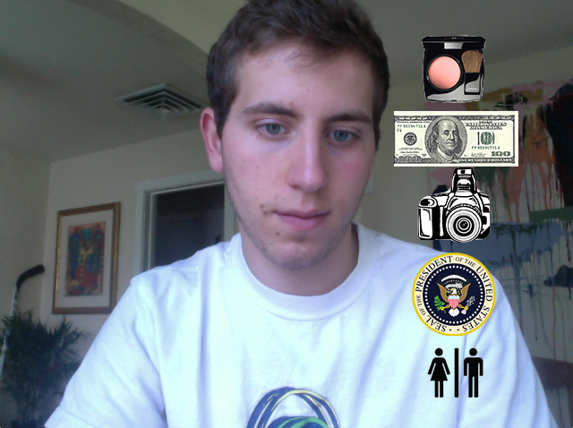
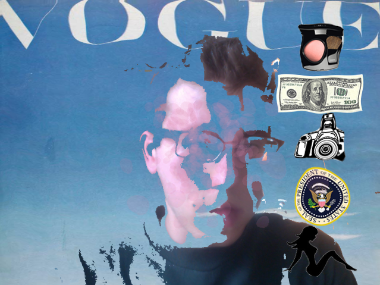
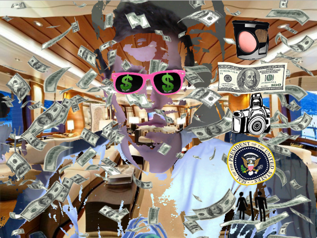
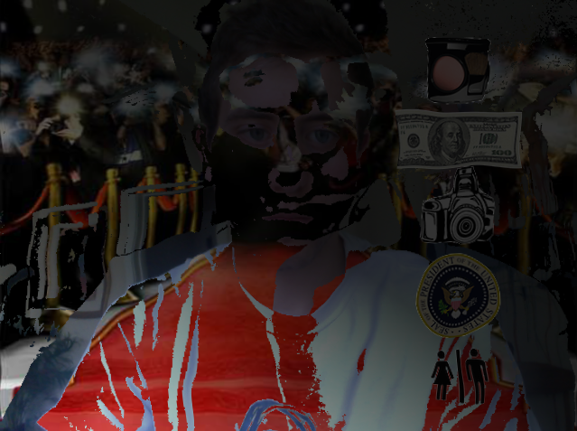
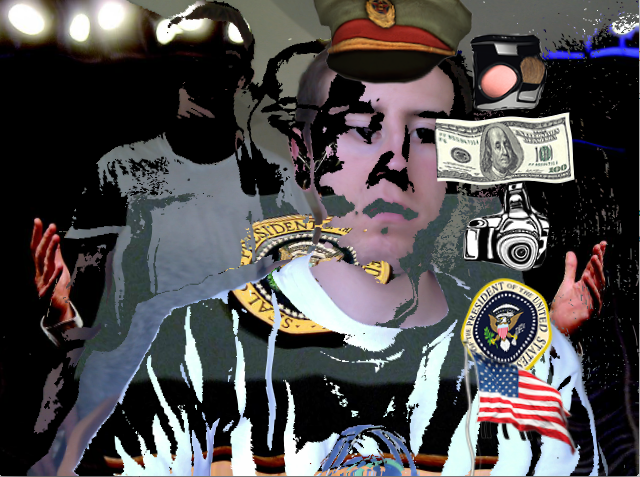
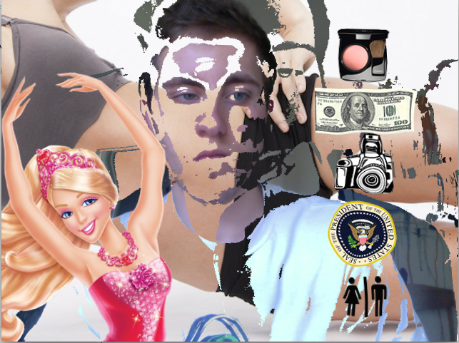
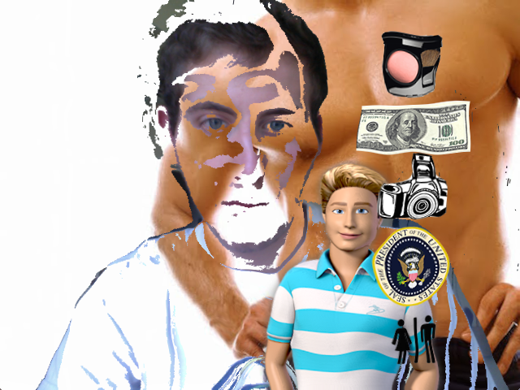

#Self Image Distortion 
##Final Project for Advanced Coding 

This project is meant to help people see themselves as beautiful for who they are beneath the masks of cultural status. It's important to continue developing self respect by realizing the distortion of happiness in common objectives of the american dream(beauty,money,power,popularity, and an attractive mate). Distortion increases overtime till a breaking point occurs and again we see ourselves removed from our fantasy.  There is a small icon display on the right side to navigate through modes and by replacing the spacebar the mask layer will be reset. This project also uses a basic perlin noise GL shader to distort the image over time. 

The opening of the program shows our original form. 

The first option (make up) places the viewer in a false sense of accomplishment gained from outer beauty.

The second choice ($100 bill) places the user in the lavish life of the wealthy. 

The third choice (camera) takes the user to the glamor of the red carpet. 

The fourth option(presedential) resembles a position of power. 

The fifth and sixth choices resemble common assumptions of what makes an attractive mate for both female and male companions. 

All of these options purposefully do a poor job of displacing the viewer from reality as to comment on the distorted, excessive constant desires of much of mankind. The manipulation of self image in all of these scenarios will eventually return the user to their "natural state" bringing us back down to earth from our fantasies. 

